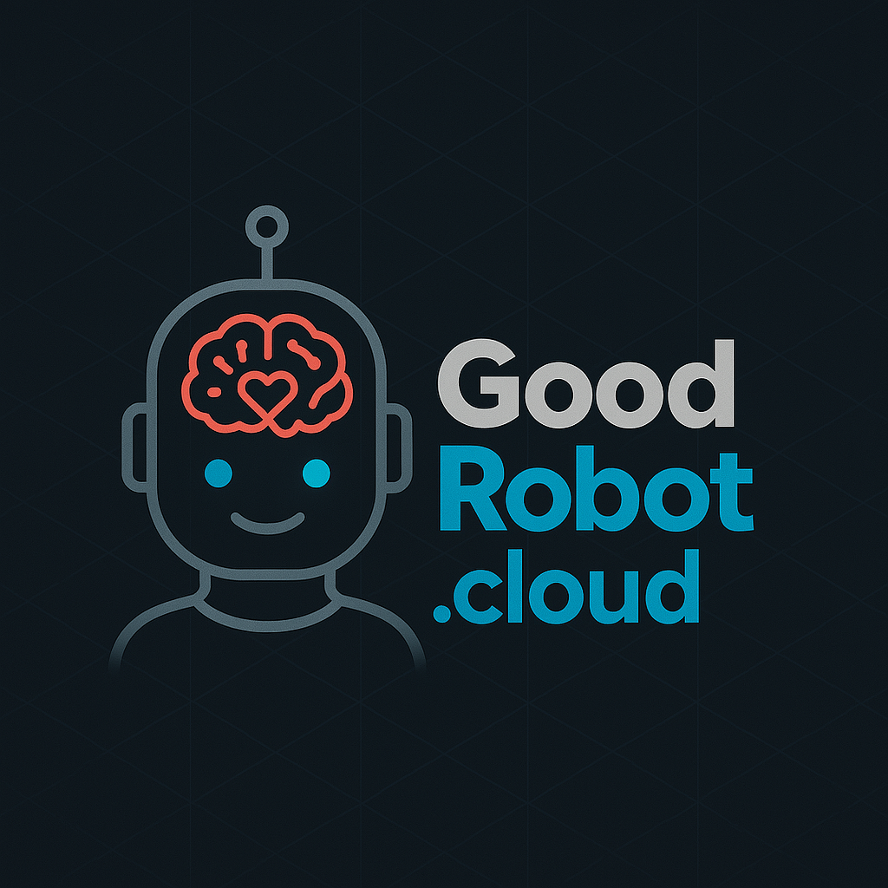
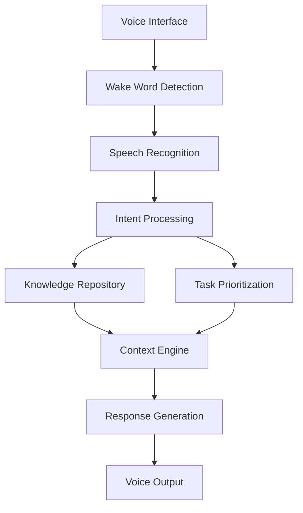

<div align="center">
  
</div>

# goodrobot - Voice AI Personal Assistant


An always-listening voice AI assistant that integrates with a personal knowledge repository to provide contextualized life management support.

## Vision

This system understands the user deeply through accumulated interactions and serves as a personal assistant, advisor, organizer, and life coach.

## Key Features

- Always-available voice interface
- Persistent memory via NotebookLLM integration
- Intelligent prioritization using reinforcement learning
- Context-aware recommendations
- Whole-life perspective

## Directory Structure

```
goodrobot/
├── README.md                     # Project overview and setup instructions
├── requirements.txt              # Python dependencies
├── config/                       # Configuration files
│   ├── settings.py               # Global settings
│   └── logging.py                # Logging configuration
├── src/                          # Source code
│   ├── voice_recognition/        # Voice recognition module
│   │   ├── __init__.py
│   │   ├── wake_word.py          # Wake word detection
│   │   └── speech_to_text.py     # STT processing
│   ├── notebook_llm/             # Knowledge repository
│   │   ├── __init__.py
│   │   ├── vector_db.py          # Vector database integration
│   │   └── knowledge_manager.py  # Knowledge management
│   ├── prioritization/           # Prioritization engine
│   │   ├── __init__.py
│   │   ├── task.py               # Task representation
│   │   ├── state.py              # State encoding
│   │   └── rl_model.py           # RL model implementation
│   ├── interface/                # User interface
│   │   ├── __init__.py
│   │   └── voice_interface.py    # Voice interaction logic
│   └── utils/                    # Utility functions
│       ├── __init__.py
│       └── metrics.py            # Performance metrics collection
└── tests/                        # Test cases
    ├── test_wake_word.py
    ├── test_speech_to_text.py
    ├── test_notebook_llm.py
    ├── test_prioritization.py
    └── test_integration.py
```

## Dependencies

The project requires the following dependencies (specified in `requirements.txt`):

```txt
# Core dependencies
numpy==1.25.2
pandas==2.1.0
pydantic==2.4.2
requests==2.31.0

# Voice processing
SpeechRecognition==3.10.0
pvporcupine==2.2.1  # Wake word detection
pyaudio==0.2.13     # Audio processing

# Knowledge repository
faiss-cpu==1.7.4    # Vector search
sentence-transformers==2.2.2  # Text embeddings
langchain==0.0.267  # LLM framework

# Machine learning
scikit-learn==1.3.0
torch==2.0.1

# Testing
pytest==7.4.0
pytest-cov==4.1.0
```

## Getting Started

1. Clone this repository:
   ```bash
   git clone <repository-url>
   cd goodrobot
   ```

2. Create and activate a virtual environment:
   ```bash
   python -m venv venv
   source venv/bin/activate  # On Windows: venv\Scripts\activate
   ```

3. Install dependencies:
   ```bash
   pip install -r requirements.txt
   ```

4. Set up pre-commit hooks for code quality:
   ```bash
   pip install pre-commit
   pre-commit install
   ```

5. Configure system settings in `config/settings.py`

6. Run initial tests:
   ```bash
   pytest
   ```

7. Start the assistant:
   ```bash
   python src/main.py
   ```

## Development

- Follow the implementation roadmap in project documentation
- Run tests before commits: `pytest`
- Use pre-commit hooks for code quality

## Code Quality

The project uses pre-commit hooks for maintaining code quality. The configuration is specified in `.pre-commit-config.yaml`:

```yaml
repos:
-   repo: https://github.com/pre-commit/pre-commit-hooks
    rev: v4.4.0
    hooks:
    -   id: trailing-whitespace
    -   id: end-of-file-fixer
    -   id: check-yaml
    -   id: check-added-large-files

-   repo: https://github.com/psf/black
    rev: 23.7.0
    hooks:
    -   id: black

-   repo: https://github.com/pycqa/isort
    rev: 5.12.0
    hooks:
    -   id: isort

-   repo: https://github.com/pycqa/flake8
    rev: 6.1.0
    hooks:
    -   id: flake8
```

## License

This project is licensed under the GNU General Public License v3.0 (GPL-3.0) - see below for a summary:

### Permissions
- ✅ Commercial use (must be open source)
- ✅ Distribution
- ✅ Modification
- ✅ Patent use
- ✅ Private use

### Conditions
- ⚠️ Disclose source: Source code MUST be made available when distributing
- ⚠️ License and copyright notice: Include a copy of the license and copyright notice
- ⚠️ Same license: Modifications MUST be released under the same license
- ⚠️ State changes: Document changes made to the code

### Limitations
- ❌ Liability: License provides no warranty
- ❌ Trademark use: Does not grant trademark rights

This license ensures that:
1. The software remains free and open source
2. Any modifications or derivative works must also be open source
3. No one can create closed-source versions
4. Commercial use is only allowed if all code remains open source

For the full license text, see [GNU GPL v3.0](https://www.gnu.org/licenses/gpl-3.0.en.html)

Copyright (C) 2024 GoodRobot Contributors

## 🗺️ Project Roadmap

### Phase 1: Foundation
- [ ] Core infrastructure setup
- [ ] Basic voice recognition system
- [ ] Initial knowledge repository
- [ ] CI/CD pipeline

### Phase 2: Intelligence
- [ ] Advanced context understanding
- [ ] Reinforcement learning integration
- [ ] Memory management system
- [ ] Task prioritization engine

### Phase 3: Integration
- [ ] Multi-device synchronization
- [ ] Privacy-focused cloud services
- [ ] API ecosystem
- [ ] Community plugins

## 🔒 Security & Privacy

goodrobot is built with privacy-first principles:

- **Local Processing**: Wake word detection and basic commands run entirely on-device
- **Data Sovereignty**: Your personal knowledge repository remains under your control
- **Encryption**: All cloud communications are end-to-end encrypted
- **Transparency**: Regular security audits and open-source verification
- **Compliance**: Built to exceed GDPR and CCPA requirements

## 🏗️ Architecture



## 🛡️ AI Safety & Compliance

### Monitoring & Verification
The system implements comprehensive monitoring and verification through:
- Advanced behavioral contract verification
- Real-time monitoring of AI system states
- Formal verification methods for critical components
- Contract algebra operations for interface verification
- Sophisticated theorem proving for safety properties

### ISO Compliance & Standards
The project adheres to key ISO standards for AI systems:
- ISO/IEC 25059 - Quality requirements and evaluation for AI systems
- ISO/IEC 42001 - AI management systems
- ISO/IEC 23894 - Risk management for AI
- ISO/IEC 24668 - AI safety and robustness

### Safety Features
- Advanced risk monitoring system with predictive modeling
- Comprehensive contingency planning for system failures
- Sophisticated interface design with behavioral contracts
- Modular design approach for better maintainability and verification
- Real-time risk assessment and mitigation

### Ethical Framework
- Built-in ethical constraints and guidelines
- Transparent decision-making processes
- Human-centric design principles
- Regular ethical audits and assessments
- Comprehensive documentation of ethical considerations

### Physical Interaction Rules
For deployments involving physical interaction:
- Strict motion control parameters
- Well-defined safety zones and boundaries
- Clear protocols for human-AI interaction
- Emergency stop mechanisms
- Regular safety assessments

## 💝 Support the Project

### Why Support GoodRobot?
Your support helps us:
- Maintain and improve the core infrastructure
- Develop new features and capabilities
- Ensure long-term sustainability
- Keep the project open source and accessible
- Fund security audits and compliance certifications

### Ways to Contribute
1. **GitHub Sponsors**
   - Monthly sponsorship options
   - One-time donations
   - Special recognition for sponsors
   - Early access to new features

2. **Open Collective**
   - Transparent funding management
   - Community-driven fund allocation
   - Regular financial reports
   - Public recognition for backers

3. **Cryptocurrency**
   - Bitcoin: `bc1q...` (contact maintainers for full address)
   - Ethereum: `0x...` (contact maintainers for full address)
   - Other cryptocurrencies available upon request

4. **Corporate Sponsorship**
   - Custom support packages
   - Priority feature requests
   - Technical consultation
   - Logo placement in documentation

### Donation Tiers
- **Community Supporter** ($5/month)
  - Name in contributors list
  - Access to supporter Discord channel

- **Project Advocate** ($20/month)
  - Above benefits, plus:
  - Early feature previews
  - Monthly development updates
  - Vote on roadmap priorities

- **Sustaining Sponsor** ($100/month)
  - Above benefits, plus:
  - Direct access to core team
  - Quarterly strategy meetings
  - Custom feature consultation

- **Enterprise Partner** (Custom)
  - Above benefits, plus:
  - Priority support
  - Custom integration support
  - Security audit reports
  - Compliance documentation

### Fund Allocation
We maintain full transparency about how funds are used:
- 40% Core development
- 20% Security & compliance
- 20% Infrastructure & hosting
- 10% Documentation & community
- 10% Research & innovation

### Recognition
All supporters are recognized in our:
- GitHub README
- Documentation website
- Release notes
- Annual reports

Contact the maintainers for more information about supporting the project.

## 👥 Contributing

We welcome contributions! Here's how you can help:

### Getting Started
1. Fork the repository
2. Create a feature branch
3. Write your code
4. Add tests
5. Submit a PR

### Development Environment
- Use the provided pre-commit hooks
- Follow our coding standards
- Write meaningful commit messages

### Areas We Need Help
- 🎤 Voice recognition improvements
- 🧠 Machine learning models
- 📚 Documentation
- 🔍 Code review
- 🐛 Bug hunting

See our [Contributing Guide](CONTRIBUTING.md) for detailed instructions.

## 🌟 Community

- [Discord Server](https://discord.gg/goodrobot)
- [Community Forum](https://github.com/jurowski/goodrobot/discussions)
- [Monthly Community Calls](https://calendar.google.com/calendar/goodrobot)
- [Development Blog](https://goodrobot.ai/blog)

## 📊 Project Status

- **Development Stage**: Alpha
- **Latest Release**: v0.1.0
- **Stability**: Experimental
- **Test Coverage**: 80%
